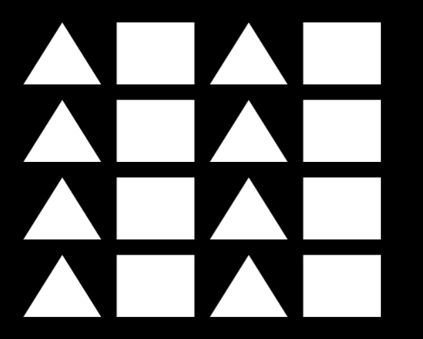
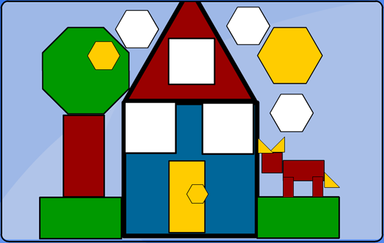

# Computação gráfica

Projetos da disciplina de computação gráfica - Curso de Engenharia de Computação

## Link do site

https://andreneves97.github.io/computer-graphics/

# Projeto 1 - Desenhando uma figura com formas geométricas

## Pré-trabalho 1

Link: https://andreneves97.github.io/computer-graphics/public/projeto-1-criando-poligonos/

 

## Pré-fase 1:

Figura escolhida:

